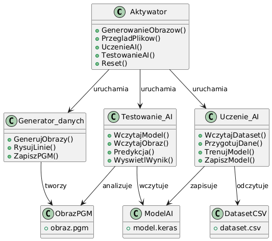

# Dokumentacja projektu

# 1. Opis działania projektu

Program realizuje założenia projektu poprzez utworzenie oraz wytrenowanie sieci neuronowej przeznaczonej do analizy obrazów i określania liczby obiektów znajdujących się na nich.

Opracowany model sztucznej inteligencji, po przeprowadzeniu procesu uczenia na odpowiednio przygotowanym zbiorze danych, potrafi rozpoznawać oraz zliczać linie występujące na obrazie. W aktualnej wersji aplikacji możliwe jest określenie liczby linii w zakresie od 1 do 10.

Przeprowadzone testy wykazały, że skuteczność działania modelu zależy przede wszystkim od liczby obrazów wykorzystanych podczas procesu uczenia oraz od rozdzielczości danych wejściowych. Wraz ze wzrostem liczby próbek treningowych obserwowano poprawę jakości klasyfikacji oraz większą stabilność uzyskiwanych wyników.

Wykonana aplikacja spełnia przyjęte na początku projektu wymagania funkcjonalne, obejmujące:

wczytywanie i przetwarzanie obrazów o rozdzielczości 640x480, 320x240 oraz 160x120,
trenowanie sieci neuronowej na podstawie wygenerowanych danych,
rozpoznawanie i zliczanie odcinków na obrazie,
filtrowanie wcześniej nałożonego szumu,
wyświetlanie wyników z odpowiednią precyzją,
dokładność detekcji przekraczającą 90%,
kompatybilność z systemami Windows 10 oraz Windows 11,
obsługę obrazów o rozmiarze do 5 MB,
czytelny interfejs użytkownika, który prowadzi przez wszystkie procesy programu.

Działanie programu opiera się na głównym module sterującym (Aktywator.exe), który odpowiada za komunikację pomiędzy poszczególnymi elementami systemu oraz zarządzanie strukturą folderów projektu. Takie rozwiązanie umożliwiło stworzenie aplikacji napisanej w języku C++, która jednocześnie wykorzystuje biblioteki dostępne w języku Python do realizacji zadań związanych ze sztuczną inteligencją.

Program działa w podziale na segmenty, z których każdy odpowiada za realizację określonego etapu pracy. Dzięki temu proces tworzenia, uczenia oraz testowania modelu sztucznej inteligencji można opisać w następujący sposób:

### Podanie wymaganych danych (Aktywator.cpp)

Proces rozpoczyna się od uruchomienia programu głównego. Użytkownik określa parametry generowanych obrazów, takie jak liczba próbek treningowych, rozdzielczość obrazów oraz nazwa pakietu danych.

### Tworzenie pakietu obrazów (Generator_danych.py)

Moduł generuje obrazy treningowe zawierające od jednej do dziesięciu linii o losowym położeniu, długości i kierunku. Utworzone obrazy zapisywane są w formacie PGM, a ich nazwy zawierają informację o rzeczywistej liczbie linii znajdujących się na obrazie. Dane te są później wykorzystywane podczas procesu uczenia sieci neuronowej.

### Proces nauki (Uczenie_AI.py)

Na podstawie wygenerowanych obrazów tworzony jest zbiór treningowy zapisany w pliku CSV. Następnie dane są przekształcane do postaci odpowiedniej dla sieci neuronowej, po czym rozpoczyna się proces uczenia modelu. Po zakończeniu treningu wytrenowana sieć neuronowa zostaje zapisana do pliku w formacie .keras, co umożliwia jej późniejsze wykorzystanie bez konieczności ponownego uczenia.

### Testowanie nowego modelu (Testowanie_AI.py)

Podczas testowania użytkownik wybiera wcześniej wytrenowany model oraz obraz przeznaczony do analizy. Program przygotowuje dane wejściowe w taki sam sposób jak podczas procesu uczenia, a następnie przekazuje je do sieci neuronowej. Wynikiem działania modułu jest przewidywana liczba linii znajdujących się na obrazie.

Proces ten można również opisać za pomocą następującego schematu:


```clips
Nazwa procesu       | Program w którym on się odbywa
                    |
Podanie parametrów  |   Aktywator.cpp
        V           |
Generowanie obrazów |   Generator_danych.py
        V           |
Tworzenie datasetu  |   Uczenie_AI.py
        V           |
Uczenie AI          |   Uczenie_AI.py
        V           |
Zapis modelu        |   Uczenie_AI.py
        V           |
Wczytanie modelu    |   Testowanie_AI.py
        V           |
Testowanie obrazu   |   Testowanie_AI.py
        V           |
Wynik testu         |   Testowanie_AI.py
```

## Pozostałe funkcje zawarte w programie 

### Sprawdzenie danych

Podczas korzystania z programu możliwe jest przeglądanie zapisanych plików. Funkcja ta wyświetla wszystkie pakiety danych wraz z ich specyfikacją.

Przykłąd :

```clips
Folder: "dane_1"
  Plik: DANE dane_1.txt
  Zawartość:
    Nazwa Pakietu: dane_1
    data utworzenia : 320
    ilosc kopii: 1000
    width: 320
    height: 240
```

### Reset / usuwanie danych

Jeżeli zajdzie potrzeba usunięcia części danych (na przykład gdy proces uczenia został przerwany), istnieje możliwość użycia funkcji reset. Program zapyta użytkownika, czy usunąć folder „Dane treningowe”, „Folder operacyjny” oraz folder zawierający gotowe modele AI.

### wyjście

Jeżeli użytkownik zakończy korzystanie z programu, może go zamknąć poprzez wybranie opcji [6] Wyjście w menu głównym.

#  2.Opis działania kluczowych fragmentów

## Biblioteki :

### TensorFlow

Biblioteka TensorFlow została wykorzystana do budowy, trenowania oraz zapisywania modelu sieci neuronowej. Umożliwia tworzenie warstw sieci, przeprowadzanie procesu uczenia oraz wykonywanie predykcji na nowych danych.

Wykorzystanie w programie:

```clips
    model = tf.keras.Sequential([

        tf.keras.layers.Input(shape=(height,width,1)),

        tf.keras.layers.Conv2D(16,(3,3),activation='relu'),

        tf.keras.layers.MaxPooling2D((2,2)),

        tf.keras.layers.Conv2D(32,(3,3),activation='relu'),

        tf.keras.layers.MaxPooling2D((2,2)),

        tf.keras.layers.Conv2D(64,(3,3),activation='relu'),

        tf.keras.layers.MaxPooling2D((2,2)),

        tf.keras.layers.Flatten(),

        tf.keras.layers.Dense(64,activation='relu'),

        tf.keras.layers.Dense(10,activation='softmax')
    ])
```

### NumPy

Biblioteka NumPy została wykorzystana do przechowywania oraz przetwarzania danych wejściowych w postaci macierzy numerycznych. TensorFlow wymaga danych zapisanych właśnie w tej formie.

Wykorzystanie w programie:

```clips
X = np.array(dataset_X, dtype=np.float32)
Y = np.array(dataset_Y)
```

### Pathlib

Biblioteka Pathlib odpowiada za obsługę ścieżek oraz katalogów programu. Umożliwia wygodne wyszukiwanie plików, tworzenie folderów oraz sprawdzanie ich zawartości.

Wykorzystanie w programie:

```clips
sciezka = Path("Folder operacyjny/Dataset/dataset.csv")

if not sciezka.exists():
    print("Nie znaleziono pliku")
    exit()
```

### argparse

Biblioteka argparse umożliwia przekazywanie parametrów z programu C++ do skryptu Python odpowiedzialnego za generowanie danych. Funkcja ta jest wykorzystywana podczas tworzenia bazy obrzów dla nauki AI . Urzytkownik podaje informacje w aktywarotze , a po ich zatwierdzienu zostaną one przekazane do 


```clips
parser = argparse.ArgumentParser()

parser.add_argument(
    "ilosc_kopii",
    nargs="?",
    type=int,
    default=ilosc_kopii
)

args = parser.parse_args()
```
### filesystem

Biblioteka filesystem została wykorzystana do kopiowania, usuwania oraz przeglądania plików i folderów projektu. Jest ona szczególnie wykorzystywana podczas procesu nauki kiedy trzeba przekopiować obrazy do folderu operacyjnego . Kolejnym przykładem zastosowania tej biblioteki jest funkcja Reset czyli usuwanie danych celem pozbycia sie nie potrzebnych danych jak i przywrócenie programu do początkowego stanu.

```clips
for (const auto& entry :
     fs::directory_iterator(sciezka))
{
    fs::remove_all(entry.path());
}
```

## Kluczowe mechaniki :

### Mechanizm uruchamiania modułów Python

Program główny został napisany w języku C++ i pełni rolę centralnego panelu sterowania. Poszczególne etapy pracy systemu (generowanie danych, uczenie modelu oraz testowanie) realizowane są przez osobne skrypty Python uruchamiane z poziomu aplikacji Dzięki temu możliwe było połączenie wygodnej obsługi programu w C++ z bibliotekami sztucznej inteligencji dostępnymi w Pythonie.

```clips
system("python Uczenie_AI.py");
```

### generowanie obrazów 

Program automatycznie generuje obrazy zawierające od 1 do 10 losowo rozmieszczonych linii. Każdemu z obrazów zostnie przydzielona osobna specyficzna nazwa zawierająca : nr pliku w folderze , faktyczna ilość linni zapisanych w folderze oraz data utworzenia dla leprzej organizacji .

```clips
for plik_nr in range(1, ilosc_kopii + 1):

    ilosc_linii = random.randint(1, 10)
    nazwa_pliku = f"{plik_nr}-{ilosc_linii}-{date.today().year}-{date.today().month}-{date.today().day}_plik-{plik_nr}.pgm"

```

### wypełnianie obrazu

Po wygenerowaniu pustego pliku mechanizm zaczyna rysować linie . Mają one różne długości , kierunki oraz mogą się one przecinać co powinno być dodadkowym wyzwaniem dla modelu. Perocedura kończy się dodaniem szumu czyli przypadkowo wygenerowanych pikselach .

```clips
def draw_line(x, y):

    half = thickness // 2

    for dy in range(-half, half + 1):
        for dx in range(-half, half + 1):

            ny = y + dy
            nx = x + dx

            if 0 <= ny < height and 0 <= nx < width:
                image[ny][nx] = "0"
```
### mechanika usuwania szumu

Przed utworzeniem zbioru treningowego program przeprowadza prostą filtrację obrazu w celu usunięcia pojedynczych zakłóceń. Mechanika ta jest oparta na prostym rozwiązaniu , porównywania pikseli i usuwania pojedynczych elementów .

```clips
if (x > 0 &&
    x + 1 < width &&
    mapa[y][x-1] == 255 &&
    mapa[y][x] == 0 &&
    mapa[y][x+1] == 255)
{
    mapa[y][x] = 255;
}
```
### Mechanizmy procesu uczenia

Przed rozpoczęciem treningu wszystkie obrazy są wczytywane z pliku CSV i zamieniane na macierze numeryczne. Następnie dane są przekształcane do postaci wymaganej przez sieć konwolucyjną CNN. Dzięki temu dane mogą zostać przekazane do modelu sieci neuronowej.

```clips
X = np.array(dataset_X, dtype=np.float32)
Y = np.array(dataset_Y)

X = 1 - X

X = X.reshape(-1, 120, 160, 1)
```
Opis kluczowych elementów : 
- dataset_X - zawiera piksele obrazów
- dataset_Y - zawiera poprawne odpowiedzi
- 1 - X - zamienia kolor linii na bardziej czytelną postać dla sieci
- reshape() - tworzy obrazy o rozdzielczości 160×120 pikseli

### Proces trenowania modelu

Po przygotowaniu danych rozpoczyna się właściwe uczenie sieci neuronowej. Model analizuje obrazy oraz odpowiadające im etykiety, stopniowo dostosowując swoje parametry. W wyniku tego procesu powstaje wytrenowany model zdolny do rozpoznawania liczby linii na obrazach.

```clips
model.fit(X,Y,epochs=30,batch_size=32,validation_split=0.2,verbose=1)
```
Opis kluczowych elementów : 
- epochs=30 - oznacza trzydzieści przejść przez cały zbiór danych,
- batch_size=32 - określa liczbę obrazów analizowanych jednocześnie
- validation_split=0.2 - przeznacza 20% danych do kontroli jakości modelu

### Wczytanie obrazu testowego

Podczas testowania program odczytuje wskazany obraz i zamienia go na dane numeryczne wykorzystywane przez model. Program odczytuje zawartość pliku .pgm, a następnie zamienia wartości pikseli na liczby binarne (1 dla tła , 0 dla linii) . Tak przygotowane dane są następnie przekazywane do sieci neuronowej.

```clips
with open(plik_testowy, "r") as plik:
    dane = plik.read().split()

for x in dane[4:]:

    if int(x) == 255:
        input_data.append(1)
    else:
        input_data.append(0)
```

### Wykonanie predykcji

Po przygotowaniu obrazu model wykonuje analizę i zwraca najbardziej prawdopodobną liczbę linii znajdujących się na obrazie.

```clips
wynik = model.predict(X)

odpowiedz = np.argmax(wynik)

print(
    "AI uważa że na obrazie jest:",
    odpowiedz + 1,
    "linii"
)
```
Funkcja predict() zwraca prawdopodobieństwo dla każdej klasy od 1 do 10 linii. Następnie np.argmax() wybiera klasę o najwyższym prawdopodobieństwie, która zostaje wyświetlona użytkownikowi jako wynik działania sztucznej inteligencji.

# 3.Instrukcja instalacji oraz korzystania z programu

### Instrukcja środowiska w Visual Studio Code

Do uruchomienia programu wymagany jest interpreter języka Python. W przypadku korzystania z Visual Studio Code konieczne będzie również zainstalowanie odpowiednich rozszerzeń oraz bibliotek. Poniżej przedstawiono listę wymaganych elementów wraz z instrukcją ich instalacji.

- Instalacja rozszerzeń

    Aby Visual Studio Code mogło poprawnie obsługiwać oraz uruchamiać pliki z rozszerzeniem .py, należy zainstalować następujące rozszerzenia:

    Python
    Pylance
    Python Debugger
    Python Environments

    W przypadku zagubienia , można również aktywować zakładkę srkutem (Ctrl + Shift + X).

- Pobranie interpretera dla Pythona

    Interpreter Python można pobrać z oficjalnej strony internetowej projektu. Zalecaną wersją jest Python 3.11.9. Po pobraniu odpowiedniej wersji należy uruchomić instalator i przeprowadzić standardowy proces instalacji.

- Instalacja Bibliotek

    Po poprawnym zainstalowaniu języka Python należy otworzyć konsolę Windows PowerShell i wykonać kolejno poniższe polecenia:

    ```clips
    pip install tensorflow

    pip install numpy
    ```

    Po zakończeniu instalacji bibliotek należy wskazać interpreter używany przez Visual Studio Code. Zalecane jest wykonanie tej czynności w następujący sposób :

    1. Uruchom Visual Studio Code.
    2. Użyj kombinacji klawiszy Ctrl + Shift + P. Powinno to otworzyć okno poleceń u góry ekranu.
    3. Wpisz polecenie: Python: Select Interpreter.
    4. Wybierz interpreter Python 3.11.9.

   Jeżeli wszystkie kroki zostały wykonane poprawnie, środowisko będzie gotowe do pracy z projektem. Program nie wymaga dodatkowej aktywacji ani konfiguracji. Po zainstalowaniu wymaganych komponentów jest gotowy do użycia.

    (tutaj opis instalacji Pythona na komputerze)

### Instrukcja obsługi programu

1. Uruchomienie programu

    Uruchom Aktywator.cpp.

2. Wprowadzenie danych

    Po uruchomienu programu należy wybrać opcje [1] , wypełnić wymagane informacje i zapisać paczkę danych. W przypadku wątpliwości czy paczka została odpowiednio zapisana można skorzysać z opcji [2] przegląd plików .


3. Proces uczenia

  Po uruchomieniu funkcji [3] Uczenie AI wybrany pakiet danych zostanie skopiowany do folderu operacyjnego. Następnie obrazy zostaną oczyszczone z niepożądanego szumu oraz zapisane do zbioru danych dataset.csv. Po przygotowaniu zbioru rozpocznie się proces uczenia sieci neuronowej. Po jego zakończeniu program poprosi o podanie nazwy modelu i zapisze go w folderze „Gotowe_AI”.

4. Testowanie modelu

    Wybrany model można przetestować na wcześniej przygotowanym obrazie w formacie .pgm, umieszczonym w folderze „Plik do testów”. Program wczyta wskazany plik, przeprowadzi analizę obrazu i wyświetli przewidywaną przez AI liczbę linii oraz rzeczywistą wartość odczytaną z nazwy pliku.

    Uwaga! Jeżeli użytkownik chce zresetować program, usunąć wybrane dane lub pozbyć się niepotrzebnych plików, może skorzystać z funkcji [5] Reset, która umożliwia usunięcie wybranych elementów projektu.
5. Zakończenie
    
   Po zakończeniu pracy program można zamknąć za pomocą opcji [6] Wyjście.

### Dodatkowe oprogramowanie użyte podczas tworzenia programu

W trakcie pracy z programem tworzone są pliki w kilku różnych formatach. Aby wygodnie przeglądać ich zawartość, warto zainstalować oprogramowanie obsługujące te typy plików.

Format .pgm

- IrfanView (zalecane)
- GIMP
- Adobe Photoshop

Format .csv

- Visual Studio Code (zalecane)
- Microsoft Excel
- LibreOffice Calc

Format .keras 

- Visual Studio Code
- PyCharm 
- Anaconda / Jupyter Notebook
- Google Colaboratory

Programy oznaczone jako „zalecane” były wykorzystywane podczas tworzenia oraz testowania projektu. Programy operujące na foramcie .keras nie są wymagane do funkcjonowania programu gdyż nie będzie potrzeby otwierania plików z tyym formatem .


#  4.Testy jakości utworzonych modeli

Po utworzeniu i wytrenowaniu modeli przeprowadzono testy mające na celu ocenę skuteczności działania sieci neuronowej. Każdy model został poddany serii 100 prób z wykorzystaniem wcześniej wygenerowanych obrazów testowych. Celem eksperymentu było sprawdzenie wpływu liczby obrazów treningowych oraz ich rozdzielczości na jakość rozpoznawania liczby odcinków znajdujących się na obrazie.

Uzyskane wyniki przedstawiono w poniższej tabeli. Przedstawia ona zmiany skuteczności modelu w zależności od liczby danych treningowych:


| Ilość obrazów | 640x480 błędy | 640x480 skuteczność | 320x240 błędy | 320x240 skuteczność | 160x120 błędy | 160x120 skuteczność |
|--------------:|-------------:|--------------------:|-------------:|--------------------:|-------------:|--------------------:|
| 100 | 38 | 62 % | 44 | 56 % | 51 | 49 % |
| 200 | 31 | 69 % | 38 | 62 % | 44 | 56 % |
| 500 | 24 | 76 % | 29 | 71 % | 34 | 66 % |
| 1000 | 18 | 82 % | 22 | 78 % | 27 | 73 % |
| 1500 | 15 | 85 % | 18 | 82 % | 23 | 77 % |
| 2000 | 13 | 87 % | 15 | 85 % | 20 | 80 % |
| 2500 | 11 | 89 % | 13 | 87 % | 18 | 82 % |
| 5000 | 8 | 92 % | 10 | 90 % | 9 | 87 % |
| 10000 | 3 | 95 % | 7 | 93 % | 6 | 91 % |


Wykres zależności : 


160x120 - czerwony , 320x240 - niebieski , 640x480  - żółty 


Wnioski :
Eksperyment wykazał, iż rozdzielczość oraz liczba obrazów użytych do nauki AI mają istotny wpływ na skuteczność rozpoznawania liczby linii. We wszystkich badanych przypadkach zwiększenie liczby obrazów treningowych prowadziło do poprawy wyników klasyfikacji. Największy wzrost skuteczności zaobserwowano pomiędzy modelami uczonymi na 1000 oraz 10000 obrazów.

Analiza wyników wskazuje również, że modele trenowane na obrazach o wyższej rozdzielczości osiągały lepsze rezultaty niż modele wykorzystujące obrazy o mniejszych wymiarach. Różnice pomiędzy poszczególnymi rozdzielczościami wynosiły od kilku do kilkunastu punktów procentowych skuteczności.

Najlepsze wyniki uzyskano dla rozdzielczości 640×480 oraz zbioru treningowego liczącego 10000 obrazów, gdzie skuteczność modelu osiągnęła poziom 95%.

Wynika z tego, iż sztuczna inteligencja lepiej radzi sobie z analizą obrazów o większej rozdzielczości.

#  5. Diagram UML

### Diagram : 



### Opis : 

Diagram klas przedstawia strukturę opracowanego systemu służącego do generowania danych treningowych, uczenia oraz testowania sieci neuronowej zliczającej liczbę linii znajdujących się na obrazie :

- Aktywator

    Centralnym elementem aplikacji jest klasa Aktywator, odpowiedzialna za obsługę menu użytkownika oraz uruchamianie poszczególnych modułów systemu. Z poziomu tej klasy możliwe jest generowanie obrazów, przeglądanie danych, trenowanie modelu sztucznej inteligencji, testowanie wytrenowanych modeli oraz resetowanie zasobów programu.

- Generator_danych
  
    Klasa Generator_danych odpowiada za tworzenie obrazów treningowych w formacie PGM. Moduł losowo generuje linie o różnych parametrach, a następnie zapisuje gotowe obrazy w odpowiednich folderach projektu.

- Uczenie_AI

    Klasa Uczenie_AI realizuje proces uczenia sieci neuronowej. Odczytuje dane zapisane w pliku dataset.csv, przygotowuje je do przetwarzania przez bibliotekę TensorFlow, przeprowadza trening modelu oraz zapisuje wytrenowaną sieć neuronową do pliku .keras .

- Testowanie_AI
  
    Klasa Testowanie_AI umożliwia wczytanie wybranego modelu oraz analizę obrazu testowego. Na podstawie predykcji wykonanej przez sieć neuronową wyznaczana jest liczba linii znajdujących się na obrazie, a wynik zostaje zaprezentowany użytkownikowi.

- Pozostałe klasy
  
    Klasy DatasetCSV, ModelAI oraz ObrazPGM reprezentują główne zasoby wykorzystywane przez system: zbiór danych treningowych, zapisany model sztucznej inteligencji oraz obrazy poddawane analizie. Klasy te pełnią funkcję pośredników pomiędzy poszczególnymi etapami działania programu i umożliwiają wymianę danych pomiędzy modułami odpowiedzialnymi za generowanie, uczenie oraz testowanie modelu.

### Kod dla wykresu : 

    ```clips
    @startuml
    class Aktywator {
        +GenerowanieObrazow()
        +PrzegladPlikow()
        +UczenieAI()
        +TestowanieAI()
        +Reset()
    }
    class Generator_danych {
        +GenerujObrazy()
        +RysujLinie()
        +ZapiszPGM()
    }
    class Uczenie_AI {
        +WczytajDataset()
        +PrzygotujDane()
        +TrenujModel()
        +ZapiszModel()
    }
    class Testowanie_AI {
        +WczytajModel()
        +WczytajObraz()
        +Predykcja()
        +WyswietlWynik()
    }
    class DatasetCSV {
        +dataset.csv
    }
    class ModelAI {
        +model.keras
    }
    class ObrazPGM {
        +obraz.pgm
    }
    Aktywator --> Generator_danych : uruchamia
    Aktywator --> Uczenie_AI : uruchamia
    Aktywator --> Testowanie_AI : uruchamia

    Generator_danych --> ObrazPGM : tworzy
    Uczenie_AI --> DatasetCSV : odczytuje
    Uczenie_AI --> ModelAI : zapisuje
    Testowanie_AI --> ModelAI : wczytuje
    Testowanie_AI --> ObrazPGM : analizuje
    @enduml
    ```

#  6.Bibliografia

- Jerzy Grębosz, Opus magnum C++. Programowanie w języku C++. Wydanie III poprawione

- Mark Lutz, Python. Wprowadzenie. Wydanie V, Helion.
- Aurélien Géron, Hands-On Machine Learning with Scikit-Learn, Keras, and TensorFlow, O'Reilly Media, 2022.
- Jason Brownlee, Deep Learning for Computer Vision, Machine Learning Mastery.
- Stuart Russell, Peter Norvig, Wprowadzenie do sztucznej inteligencji.

#  7.Netografia

https://pl.wikipedia.org/wiki/Uczenie_maszynowe

https://www.w3schools.com/python/python_ml_getting_started.asp (sekcja o uczeniu maszynowym)

https://keras.io/api/

https://impicode.pl/blog/jak-stworzyc-siec-neuronowa/

https://docs.python.org/3/

https://realpython.com/python-pathlib/

https://www.python.org/downloads/

https://www.tensorflow.org/

https://www.tensorflow.org/tutorials/images/cnn?hl=pl

https://www.geeksforgeeks.org/python/python-programming-language-tutorial/

https://code.visualstudio.com/docs/python/python-tutorial

https://www.tensorflow.org/api_docs

https://www.reddit.com/ (korzystałem z wielu różnych forów i konwersacji dlatego zostawiam tylko link do platformy)

https://www.canva.com/design/DAHMBhhf-Wc/iZ06nA-QbVTdDOmp0HA3fA/edit (narzędzie urzyte do tworzenia wykresu)

https://docs.python.org/3/tutorial/

https://numpy.org/doc/stable/

https://www.tensorflow.org/guide?hl=pl

Użyte AI podczas tworzenia tego programu :

- Chat GPT , wersja Go
- github copilot
- gemini ai , wersja przeglądarkowa

# Spis treści :

1. Opis działania projektu
2. Opis działania kluczowych fragmentów
3. Instrukcja instalacji oraz korzystania z programu
4. Testy jakości utworzonych modeli
5. Diagram UML
6. Bibliografia
7. Netografia